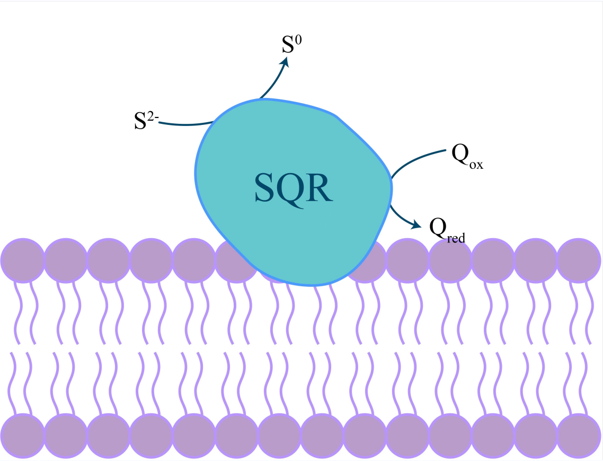
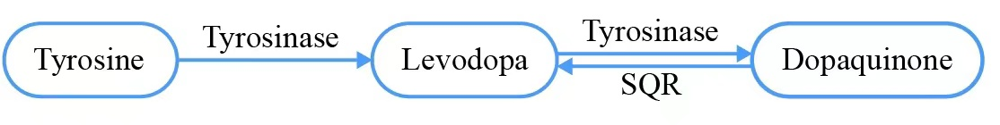
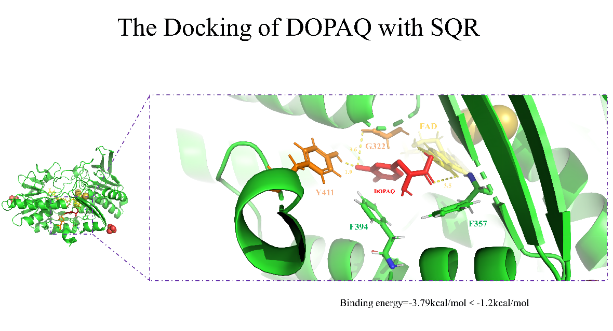

<h1>Background</h1>

**Sulfide: quinone oxidoreductase** is an ancient riboflavin protein and belongs to the disulfide oxidoreductase family (DSR). SQR widely exists in almost all organisms except plants, including archaea, bacteria and human beings. In addition to primitive respiration, its **functions** include detoxification, heavy metal resistance, and regulating the balance of the signaling molecule hydrogen sulfide in living organisms.

SQR can oxidize sulfide to sulfur with zero valence and transfer electrons to quinone through the prosthetic group FAD in order to reduce quinone to hydroquinone and eventually reaching **desulfurization**.

{width=600px}

In conclusion, SQR has great potential **application values**.With the aggravation of marine pollution, the sulfide content in sediments gradually increases. SQR is of great significance for the governance of environmental sulfur pollution. 

What’s more,presently, hydroquinone, L-DOPA and other hydroquinone drugs are mainly produced by chemical synthesis methods, which will cause great pollution and high energy consumption. SQR can be used to inhibit the oxidation of hydroquinone in the future drug biosynthesis researches,which will optimize the synthesis routes.

{width=600px}

{width=600px}

But the current **thermal stability** of SQR expressed by wild type is not high enough, the half-life is 30 minutes at the optimum temperature of 30℃.

However, high temperature reaction conditions are often needed in industrial applications. On the one hand, the reaction at high temperatures can significantly reduce contamination of the reactants, while also increasing the solubility of the substrate and making it more accessible to the enzyme. On the other hand, it has been found that higher reaction temperature leads to higher reaction rate. Therefore, if the enzyme can maintain stable catalytic activity at high temperature, the corresponding transformation time can be shortened, and then the amount of enzyme required can be reduced, so as to reduce the production cost.

As a result, we enhance the thermal stability of SQR by **rational-designed point mutations and disulfide bonds** in order to better adapt to industrial production conditions and to be produced in large amounts.