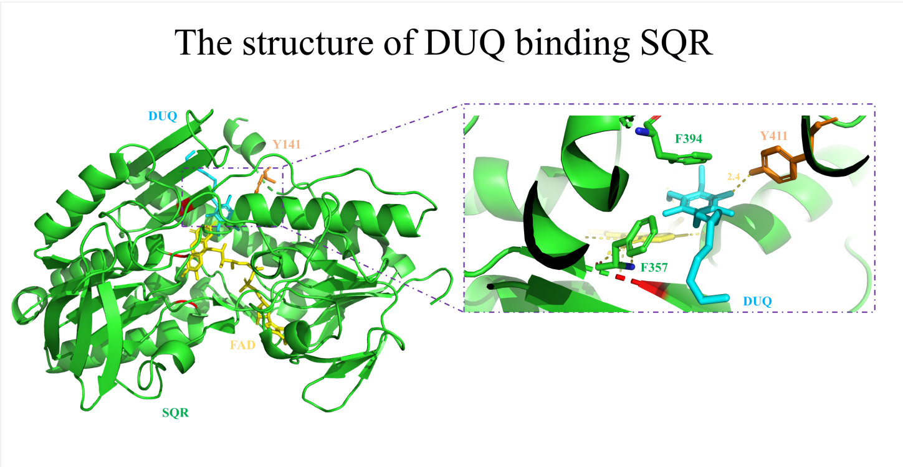

<h1>Strategy: Experimental Validation</h1>

<h2>Gene cloning, expression, and purification of SQR</h2>

Insert the codon-optimized sqr gene. Mutations are introduced into the gene by whole-plasmid PCR. These mutant plasmids are transformed into *E. coli* BL21 (DE3) for expression. 

Then induce the strains to express SQR. The fermentation broth is harvested by centrifugation. The precipitated cells are resuspended by 10mM potassium phosphate buffer ,and then broken up by high-pressure homogenizer. Lysate cells and then load onto a nickel column. 

50 mM PBS buffer containing 10 mM imidazole is used to eliminate other proteins, and 50 mM PBS buffer containing 100 mM imidazole is used to obtain pure SQR. At last, sodium dodecyl sulfate polyacrylamide gel electrophoresis (SDS-PAGE) is used to identify the molecular mass and purity of the recombinant enzyme.

    

<h2> Measurement of apparent melting temperature(Tm)</h2>

Tm is defined as the maximum of dRFU/dT. For each sample, mix 5 μL 100xSYPROTM Orange dye with 20 μL purified protein and centrifuge. Heat the sample from 25°C to 85°C at the speed of 1°C/min in the StepOnePlusTM real-time fluorescent quantitative PCR (RT-qPCR) system to determine the Tm value.

<h2> Enzyme activity determination</h2>

We use the spectrophotometry to assay enzyme activity, which depends on the reduction of the absorbance at wavelength of 275nm caused by the reduction reaction of decylubiquinone (DUQ). The activity unit of the enzyme is defined as the amount of SQR required to reduce 1μmol of DUQ per minute. 

    

