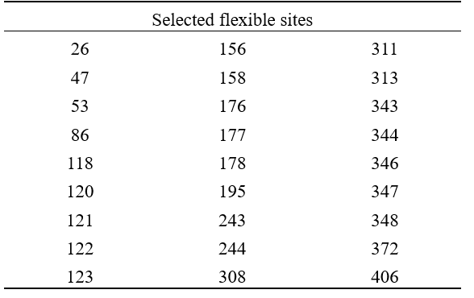
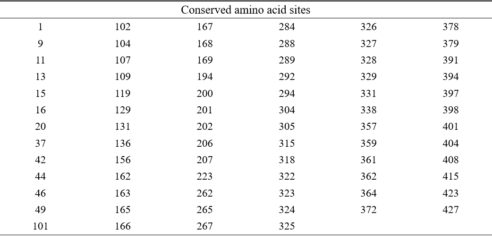
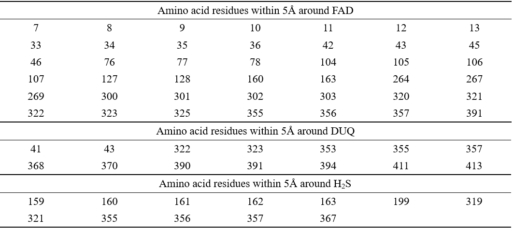
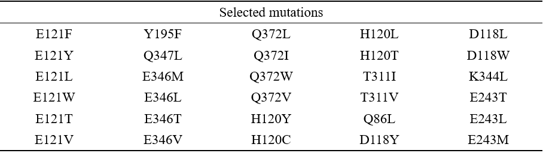
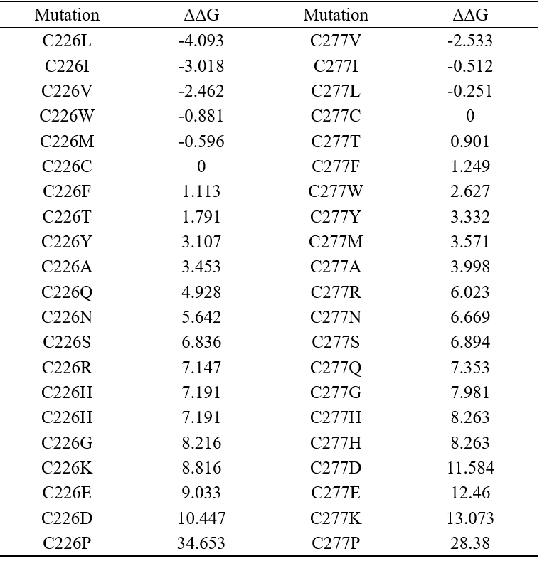
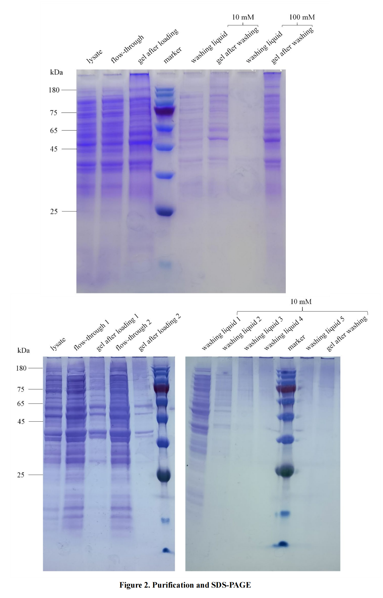

<h1>Results</h1>

<h2>Screening of flexible sites</h2>

The RMSF of each amino acid residue of wild-type SQR protein (pdb ID: 3T31) was calculated by GROMACS at 298K and 333K, and selected the amino acid sites with higher ΔRMSF and higher RMSF values at both temperatures. A total of 31 sites with high flexibility were screened. The first 10 residues in N-terminal and the last 10 residues in C-terminal have little effect on thermal stability, so we have deleted 4 residues of these kinds.

Table 1. The position number of selected flexible residues

<h2>Elimination of key sites</h2>

ConSURF-DB was used to calculate the amino acid conservation of each site of SQR, and the sites with conservation values greater than or equal to 8 were screened out. PyMOL was used to screen out the amino acid residues within 5Å around H2S, FAD and decylubiquinone (DUQ).

Table 2. The position number of conserved residues

Table 3. Active Sites of SQR.

<h2>Energy change prediction of SQR mutation sites</h2>

We comprehensively consider the results of I-Mutant 2.0 and Rosetta ddg_monomer, and chose 30 suitable mutations. Amino acid residues located in loop structures are preferentially selected over those located in helix or sheet.

Table 4. Selected mutations by I-Mutant 2.0 and Rosetta

<h2>Design of disulfide bond</h2>

The three tools predicted 189 pairs of potential residues that can form S-S bond if they were Cys. But only 9 of them have a minus ΔΔG predicted by Rosetta ddg_monomer. For these 9 pairs, PyMOL was used for visual analysis to observe whether disulfide bonds were formed. The results showed that the nine groups of free cysteine residues were not matched in orientation and could not form disulfide bonds.

<figcaption>Figure 1. Predicted cysteine residues.</figcaption>

There are a total of five cysteine residues in the SQR sequence, with serial numbers of 128,160, 226,277 and 356 respectively. Among them, 128,160,356 is an important amino acid residue in the active site, while for the other two, cysteine residues without disulfide bond are unfavorable to the stability of the enzyme. In the previous prediction of disulfide bond, amino acids that can form disulfide bond with cysteine 226,277 were not found, so we tried to mutate these two cysteines. Rosetta ddg_monomer was used to predict the free energy changes of cysteine 226, 277 to other 19 amino acids. 

Table 5. ΔΔG of C to X mutations

We chose the 277 residues which is in the loop structure, and select the C277V mutation.

<h2>Expression and Purification</h2>
We did enzyme fermentation and purification many times, but got strange results. Sometimes there were still many proteins left on the nickel column even after washed with 300 mM imidazole, but sometimes they had all been washed down after washed by 10 mM imidazole.

<h2>Future Plan</h2>
Now we have completed the construction of the bacteria and have rich experience in protein purification. We will perform mass spectrometry operation after October 10th to verify the identified bands, and then draw the enzyme activity curve to perform qpcr operation of the protein to measure the improvement of protein heat resistance. After that, we will screen the three mutations with the best effect and introduce the three mutations into the same bacterium to further improve the heat resistance of the protein. The experiment is expected to be carried out in mid-November. After that, we will calculate the enzyme activity again, and carry out the construction, fermentation, purification and determination of enzyme activity enhancement in the same way.