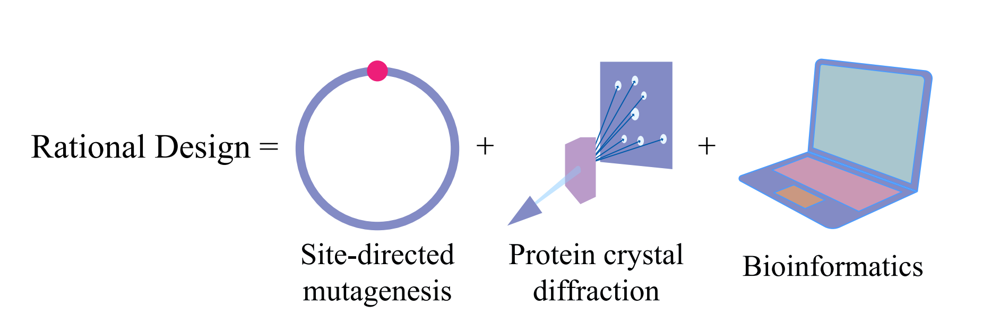
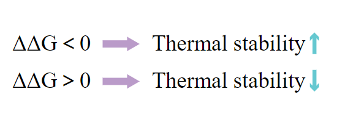
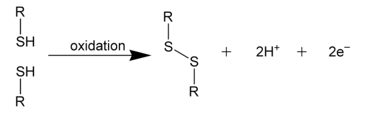

<h2>Strategy: Rational Design<h2>

<h2><i>1. What is rational design?</i></h2>

The rational protein design strategy is mainly based on **site-directed mutagenesis** and **protein crystal diffraction technology**. Bioinformatics or computer-aided methods are used to purposefully introduce new amino acids at specific sites, so as to modify specific properties of target proteins, such as thermal stability. This strategy is easy to conduct and it can save a lot of time. To minimize the selection workload and the randomness of the directed evolution technique, we apply this strategy to find those mutation sites. 

    

<h2><i>2. How to design?</i></h2>

By analyzing the crystal structure of enzyme, computer-aided design can predict the conformational stability of each amino acid residue in the target protein and the change of the free energy of unfolding of each mutant protein, so as to design the mutation sites that can potentially improve its thermal stability.

The frequently-used software and programs are: SWISS -MODEL；Disulfide by Design；MODIP；MODELLER 9.9；GROMACS；B -FITTER；PyMol; ccp4；Discovery Studio 3.5; ESyPred3D；ESBRI；libSVM.

<h2><i>3. How do we select?</i></h2>

In our experiment, we screen the mutation sites by predicting the effect of mutation on the free energy of unfolding of enzyme.  

$\Delta\Delta G=\Delta G_\mathrm{mutant}-\Delta G_\mathrm{wild}$

$\Delta\Delta G$：*the effect of mutations on the free energy of unfolding(*$\Delta G$*) of protein molecules simulated by computer-aided analysis*
When $\Delta\Delta G$ is **less than zero**, it indicates that the mutation could **improve the thermal stability of the target protein**, and the smaller the $\Delta\Delta G$ mutation is, the better the thermal stability of the target protein, while when $\Delta\Delta G$ value is **greater than zero**, it indicates that the mutation **decreases the thermal stability of target protein**.

.png){width=600px}

    

<h1>Point mutation </h1>

<h2><i>1. Screening of flexible sites</i></h2>

Use GROMACS to calculate the Root mean square fluctuation (RMSF) of each amino acid residue of SQR. Amino acid sites with high flexibility are selected.

<h2><i>2. Elimination of key sites</i></h2>

Obtain evolutionarily conserved sites of proteins from ConSURF-DB. Collect the sequences with **high similarity to the target sequences**. And then perform multiple sequence alignment (MSA) by MAFFT method. Calculate evolutionary conservation of each position, and then rank them on a scale of 1 to 9. Residues with a conserved rank greater than 8 are **removed** from the mutation library.

Select residues within 5Å around the catalytic sites by PyMOl. Then eliminate the residues.

<h2><i>3. Energy change prediction of SQR mutation sites</i></h2>

<h3>(1) Prediction by Rosetta </h3>

**Rosetta ddg_monomer** predicts mutation sites that can potentially improve the thermal stability of the target protein through computing the change of folding free energy ($\Delta\Delta G$) of each mutant protein relative to the wild protein. Before computing, we need to **minimize the three-dimension structure** of the target protein in advance to reduce the interference of molecular collision in the process of protein unfolding. 

<h3>(2) Prediction by I-Mutant 2.0 </h3>

Prediction can be made online directly on the website (http://folding.biofold.org/i-mutant/i-mutant2.0.html).

By inputting amino acid sequences of target protein into the software,we can observe the change of the unfolding free energy ($\Delta\Delta G$ value) of each mutant protein. Thus the positive and negative effects of the mutation site on the thermal stability of the protein can be measured by it.

**We comprehensively consider two methods to select suitable mutations.**</u>

<h1>Disulfide bond</h1>

<h2><i>1. What is disulfide bond?</i></h2>

The covalent bond formed by oxidation of the sulfhydryl groups of the two Cys side chains is called a disulfide bond. It is a **high strength interaction force**, which effects the stability of enzyme mainly depends on the entropy.

{width=600px}

<h2><i>2. How to design a disulfide bond?</i></h2>

We use three methods to design our disulfide bond. 

**Disulfide by Design 2.0 (DbD2)** (http://cptweb.cpt.wayne.edu/DbD2/index.php) predicts the potential amino acid residues on the assumption that all the residues mutate into Cys, and then it gives the potential residue pairs by assessing the steric configuration of the disulfide bond formed by each residue pair and calculating the χ3 torsion angle and the Cα-Cβ-Sγ angle of all residue pairs.

**MODIP** (http://caps.ncbs.res.in/iws/modip.html) estimates the sites of protein by using the conformation parameter of natural classic disulfide bond to build the staging hierarchy.

**BridgeD** (http://biodev.cea.fr/bridged/) uses multiple protein structures to improve the flexibility of the protein skeleton, aiming to find the potential disulfide-bond-forming sites.

Pool all the residue pairs that could form disulfide bonds predicted by these three methods together, and eliminate the above key sites, and calculate the $\Delta\Delta G$ after mutation by Rosetta. For mutation combinations with $\Delta\Delta G$ less than 0, PyMOL was used to observe whether the pairs of cysteine residues were matched after mutation.

<h2><i>3. What about the rest of the sulfhydryl groups?</i></h2>

The formation of disulfide bond by sulfhydryl groups can increase the thermal stability of enzyme. However, the **free sulfhydryl group** is easy to be oxidized, which will have a **negative effect** on the thermal stability of enzyme.

There are five cysteine residues in the sequence of SQR, with the sequence numbers of 128,160,226,277,356, respectively. 128,160,356 are important amino acid residues in the active site, while for the other two sites for cysteines, their sulfhydryl groups are free, which is not good for thermal stability. Therefore, the two cysteines are attempted to be mutated into other amino acids in the same way as the point mutation described above.