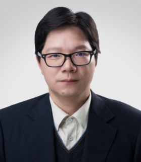
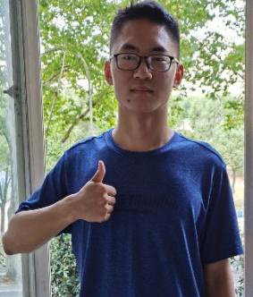
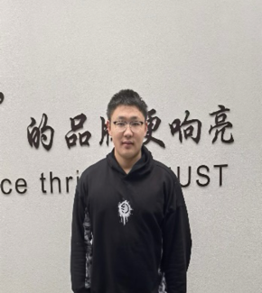
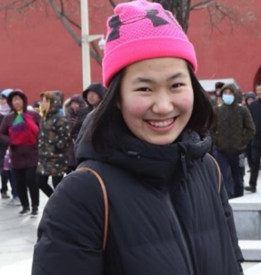
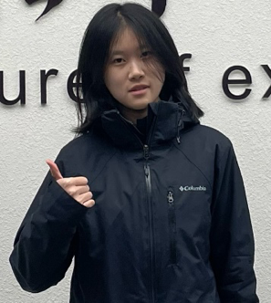
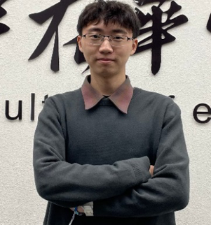
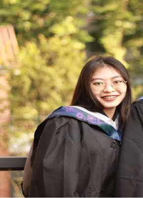
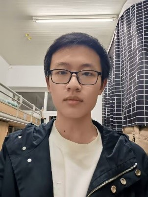
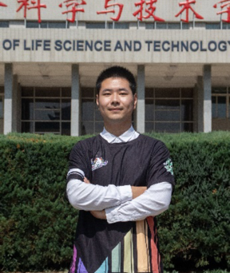

<h1>Our Team</h1>

<h2>Supervisor</h2>

    
    <figcaption><b>Yunjun Yan</b> 
</figcaption>

**Personal profile**: Associate dean of Life Science and Technology School, Huazhong University of Science and Technology. Second-class professor, doctoral supervisor, Deputy Director of the Key Laboratory of Molecular Biophysics of the Ministry of Education. He has presided over several national major projects. He has long been guiding various discipline competitions, leading students to carry out innovation and entrepreneurship training and scientific research practice. With rich experience, he has guided iGEM team to win the International Gold award for many times.

**Position**: School of Life Science and Technology, Huazhong University of Science and Technology

<h2>Team leader</h2>

    
    <figcaption><b>Tiancheng Liu</b> 
<b>Major</b>: Biological science, Huazhong University of Science and Technology 
<b>Attribution</b>: Team leader, take in charge of the team,design the experiment, measure the apparent melting temperature and write the report.</figcaption>

<h2>Team member</h2>

    
    <figcaption><b>Shuo Zhang</b> 
<b>Major</b>: Biological science, Huazhong University of Science and Technology 
<b>Attribution</b>: Do the deputation experiment, analyses the result of the experiment, guide experimental operation, assist to write the report.</figcaption>
    
    <figcaption><b>Yuxuan He</b> 
<b>Major</b>: Biological science, Huazhong University of Science and Technology&Paris-Saclay University 
<b>Attribution</b>: Do the cloning and expression of genes, purify SQR, write the wiki of experiment, assist to write the report.</figcaption>
    
    <figcaption><b>Xinchen Xie</b> 
<b>Major</b>: Biological science, Huazhong University of Science and Technology&Paris-Saclay University 
<b>Attribution</b>: Construct functional bacteria used in the experiment, Read the literature to help design the experiment, assist to write the report.</figcaption>
    
    <figcaption><b>Yi Xin</b> 
<b>Major</b>: Biological science, Huazhong University of Science and Technology&Paris-Saclay University 
<b>Attribution</b>: Determine the activity of enzyme, help to screening of flexible sites, assist to predict of SQR mutation sites.</figcaption>
    
    <figcaption><b>Ziqi Xie</b> 
<b>Major</b>：Biological science, Huazhong University of Science and Technology 
<b>Attribution</b>: Computer art, draw pictures.</figcaption>
    
    <figcaption><b>Zikai Lin</b> 
<b>Major</b>：Biological science, Huazhong University of Science and Technology 
<b>Attribution</b>: Design web, produce web.</figcaption>

<h2>Mentor</h2>

    
    <figcaption><b>Changing Fan</b> 
<b>Major</b>：Biotechnology, Huazhong University of Science and Technology  
<b>Attribution</b>: Instruct the experiment.</figcaption>

<h2>Acknowledgement</h2>

Thank The senior students in the laboratory for answering our questions patiently and gave us a lot of constructive advice.

Thank Jinsha Huang for her patiently guidance.

Thank Yunjun Yan for his guidance from the aspects of research topic selection, research innovation, and thinking on scientific problems during the whole period.

Thank Huazhong University of Science and Technology for support. 

Thank iDEC for giving us the chance to improve our experimental ability and provide a stage for us to show ourselves.